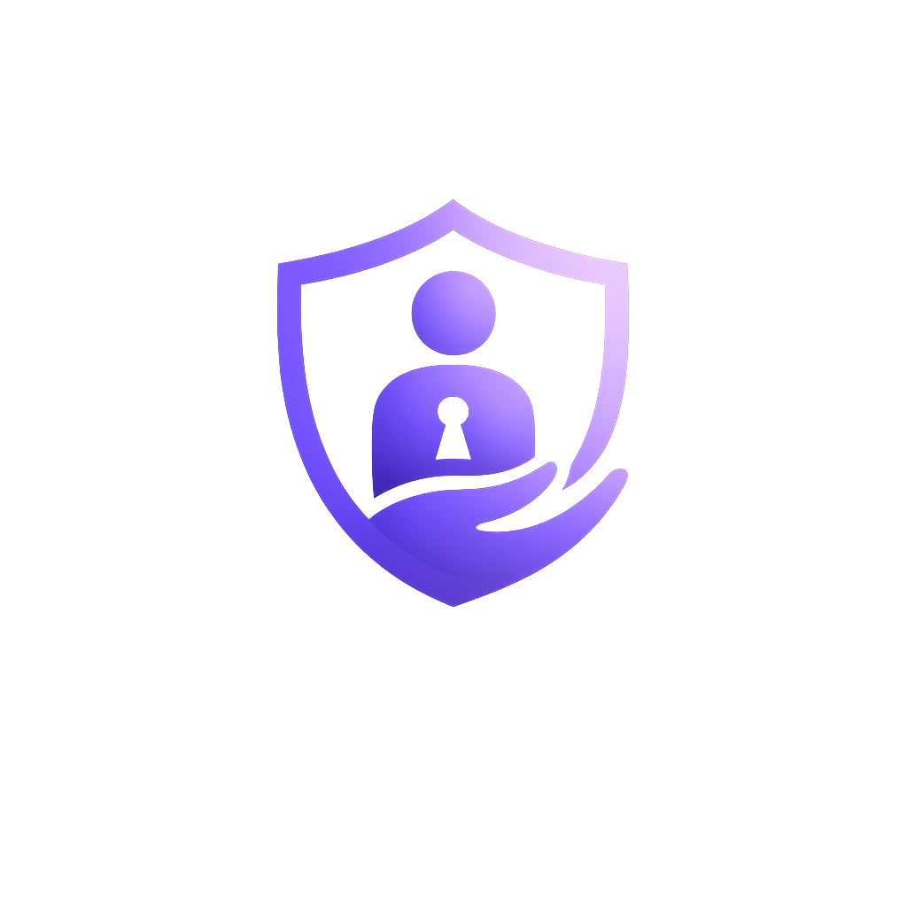

<!-- Banner -->

<p align="center">
  
</p>

<h1 align="center">🛡️ حریم | Harim</h1>
<h3 align="center">دانش، حمایت، امنیت</h3>

<p align="center">
Open-source initiative for digital safety, awareness, and support against sextortion.
<br>
تمرکز فعلی: آموزش، پیشگیری و آگاهی‌رسانی برای کاربران فارسی‌زبان
</p>

---

## 📖 درباره پروژه

**حریم** یک پروژه متن‌باز است که با هدف افزایش آگاهی عمومی درباره امنیت دیجیتال، پیشگیری از اخاذی جنسی (Sextortion) و حمایت آموزشی از قربانیان ایجاد شده است.

هدف این پروژه جایگزین شدن با پلیس، وکیل یا روان‌شناس نیست؛ بلکه تلاش می‌کند اطلاعات دقیق، مستند و کاربردی را در اختیار کاربران قرار دهد و آن‌ها را به منابع معتبر هدایت کند.

---

## 🎯 اهداف

- افزایش آگاهی درباره اخاذی جنسی
- آموزش امنیت در فضای مجازی
- معرفی روش‌های پیشگیری
- راهنمایی اولیه در شرایط بحرانی
- تولید محتوای مستند و قابل استناد
- توسعه ابزارهای متن‌باز برای آموزش و حمایت

---

## 🚧 وضعیت پروژه

پروژه در مراحل اولیه توسعه قرار دارد.

نقشه راه اولیه:

- [x] ایجاد مخزن
- [ ] تدوین مستندات
- [ ] راه‌اندازی کانال تلگرام
- [ ] تولید محتوای آموزشی
- [ ] توسعه ربات تلگرام
- [ ] توسعه وب‌سایت
- [ ] توسعه API

---

## 📂 ساختار پروژه

```
docs/        مستندات پروژه
research/    منابع و تحقیقات
content/     محتوای آموزشی
branding/    هویت بصری
bot/         ربات تلگرام
website/     وب‌سایت
api/         API
```

---

## 🤝 مشارکت

از مشارکت توسعه‌دهندگان، پژوهشگران، مترجمان، نویسندگان و فعالان حوزه امنیت دیجیتال استقبال می‌کنیم.

راهنمای مشارکت به‌زودی در فایل `CONTRIBUTING.md` منتشر خواهد شد.

---

## ⚠️ سلب مسئولیت

اطلاعات منتشرشده در این پروژه صرفاً با اهداف آموزشی ارائه می‌شوند و جایگزین مشاوره حقوقی، روان‌شناسی یا اقدامات مراجع قانونی نیستند.

---

## 📄 مجوز

این پروژه تحت مجوز MIT منتشر شده است.

---

<p align="center">
Made with ❤️ for a safer digital world.
</p>
